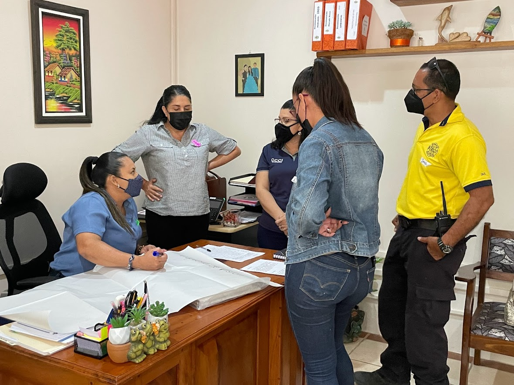
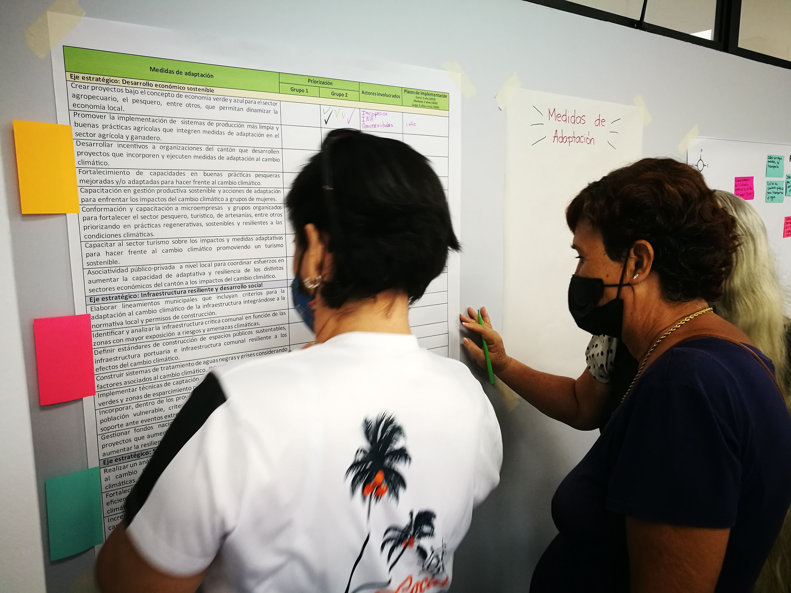
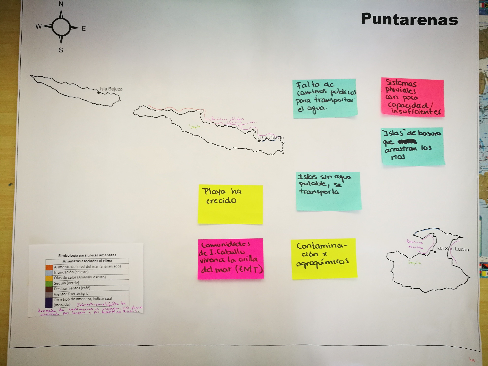

# Vinculando procesos de planificación nacional y subnacional para la adaptación al cambio climático 

## *Lecciones aprendidas en Costa Rica* 

### Introducción

Los impactos del cambio climático están ocurriendo cada vez con mayor magnitud y frecuencia. Para responder de manera efectiva es necesario no solo reducir emisiones, sino acelerar con urgencia los esfuerzos de adaptación ante el cambio climático.  Llevar a cabo procesos de planificación para la adaptación es un esfuerzo importante para que los países puedan desarrollar su resiliencia ante los impactos del cambio climático. 

Para avanzar en esta importante tarea, el régimen de cambio climático de las Naciones Unidas ha propuesto cuatro etapas o ciclos de adaptación: la primera, se orienta en evaluar los impactos, la vulnerabilidad, los riesgos y la resiliencia asociada al clima; la segunda, se enfoca en identificar y priorizar medidas de adaptación ante el cambio climático para gestionar los riesgos identificados; la tercera, busca avanzar en la implementación de las medidas de adaptación priorizadas mediante el desarrollo de estrategias y la obtención de los recursos necesarios; y la última, se enfoca en el monitoreo y la evaluación del progreso (UNFCCC, 2019).  

El Acuerdo de París reconoce que, si bien la adaptación es un desafío mundial, tiene dimensiones locales y subnacionales (CMNUCC, 2015). El Panel Intergubernamental del Cambio Climático (IPCC) también ha señalado que la planificación desde el ámbito nacional debe ir acompañada por procesos de planificación e implementación en distintos niveles de gobernanza (regional, local), para mejorar su efectividad (IPCC, 2014).  Por lo tanto, resulta de gran importancia que los procesos de planificación de la adaptación se realicen tanto a nivel nacional como a nivel subnacional, y que se creen vínculos intencionales y estratégicos entre la planificación, la implementación y el M&E en estos distintos niveles. A esto se le conoce como  “integración vertical” (Dazé, et al. 2016).  

 La inclusión de actores e insumos capturados a nivel subnacional en los procesos de planificación nacional es fundamental para asegurar la integración vertical. Quienes tienen mayor entendimiento del contexto local, incluidas las visiones, realidades, y prioridades de desarrollo, tienden a ser aquellas instituciones que tienen mayor cercanía con las comunidades, hogares y sociedad civil, como lo son los gobiernos locales, las organizaciones de base comunal, u otras autoridades subnacionales. Además, si bien las prioridades pueden identificarse a través de un proceso impulsado desde el nivel nacional, en la implementación de acciones inevitablemente se deberá involucrar a actores subnacionales (Dazé, et al., 2016).  
 
 Considerando la gran importancia de avanzar en la planificación de la adaptación a nivel nacional y subnacional, así como de asegurar la articulación y alineación de esfuerzos realizados en estos distintos niveles, resulta de gran relevancia que se compartan experiencias sobre los retos y oportunidades que encuentran instancias nacionales y subnacionales al llevar a cabo estos procesos en la práctica. Con ese fin en mente, el siguiente informe proporciona lecciones aprendidas durante la ejecución de procesos de planificación para la adaptación al cambio climático llevados a cabo en las seis regiones socioeconómicas de Costa Rica durante los años 2020 y 2021, así como durante la integración de estas prioridades dentro del proceso de elaboración del Plan Nacional de Adaptación 2022-2026.  

 ### Algunas lecciones clave para procesos futuros de planificación para la adaptación al cambio climático 

 **1. Aprovechar estructuras de coordinación y articulación existentes para evitar duplicaciones de esfuerzos y asegurar una mayor cercanía entre las agendas de cambio climático y de desarrollo.**   
 
 El realizar los procesos de planificación desde estructuras de coordinación y articulación existentes (COREDES y CIR Ambiente) permitió aprovechar el conocimiento que éstas tienen del contexto regional así como su cercanía con los actores, tanto institucionales como sociales. Además, sentó las bases para el futuro seguimiento a la implementación de las medidas de adaptación priorizadas en el marco de estas estructuras.   
 
 Es importante validar que las estructuras existentes faciliten la participación de distintos grupos, incluidas poblaciones en condiciones de vulnerabilidad. Se recomienda tomar medidas adicionales para asegurar la participación de estos actores, ya sea dentro de la estructura existente, o mediante el establecimiento de mecanismos complementarios que permitan integrar a una mayor cantidad de actores clave del territorio en el proceso. De esta manera, se mejora la heterogeneidad y representatividad de los participantes en el proceso. En el caso de este proceso, MINAE y MIDEPLAN realizaron un proceso de mapeo, análisis y priorización de actores clave, considerando sus roles e influencia en las decisiones regionales, y esto llevó a hacer convocatorias ampliadas, en las cuales se invitaron a actores adicionales, más allá de los que normalmente participan en las sesiones de los COREDES y CIR Ambiente. 

 

**2. Aliarse con grupos representativos de poblaciones clave desde un inicio para asegurar su inclusión y solventar potenciales limitantes para su participación.** 

 La inclusión en los procesos de planificación para la adaptación al cambio climático requiere que se identifiquen los espacios donde participan poblaciones específicas que se desea incluir. Además de las plataformas de articulación y diálogo regionales, el involucrarse en los espacios diseñados por y para estos grupos poblacionales para deliberar y hacer valer sus derechos, puede mejorar su involucramiento en los procesos y asegurar instrumentos más inclusivos.  
 
 La identificación de esquemas de asociatividad de mujeres permitió asegurar la participación de las mujeres y la integración de sus narrativas, necesidades y oportunidades tanto en los diagnósticos como en los planes de acción. También, el contacto con el *Instituto Nacional de la Mujer (INAMU)* a través de entrevistas y grupos focales permitió integrar consideraciones desde la perspectiva de género relevantes para la adaptación en las regiones. Los esfuerzos para un proceso de planificación más inclusivo permitieron la participación de otras poblaciones, entre ellas, representantes de poblaciones indígenas.  En este caso, se exploraron las necesidades que permitieran una mejor participación; una de ellas fue la conectividad digital, con lo que fue posible apoyar.

 

 **3. Para la elaboración de los análisis de riesgos, resulta valioso utilizar información tanto cuantitativa como cualitativa, especialmente si existen vacíos importantes de información a escala regional.**  
 
 La información cuantitativa disponible para generar análisis de riesgo a escala regional en ocasiones es limitada, poco accesible o se encuentra desactualizada. Además, el nivel de agregación de los datos limita el análisis con perspectiva de género o considerando las necesidades de grupos poblacionales específicos, como poblaciones indígenas, poblaciones afrodescendientes, personas con discapacidad, niñez y juventudes. Por lo tanto, es necesario mejorar la recopilación de datos desagregados que permitan identificar condiciones clave que inciden en la vulnerabilidad y exposición de las regiones a los efectos de la variabilidad y el cambio climático.  
 
 En el caso de este proceso, los diagnósticos regionales basados en datos e información estadística disponible, así como en los mapas de riesgos asociados al clima, fueron complementados con las vivencias de los actores participantes sobre sus experiencias, necesidades y soluciones.  Esto permitió que las cadenas de impacto fueran enriquecidas a partir de las narrativas y vivencias de personas locales. 

 

Para información adicional sobre el [Programa Cantones Resilientes](https://www.youtube.com/watch?v=Qpdsv3lulGg), contacte a [raquel.gomezramirez@un.org](mailto:raquel.gomezramirez@un.org)

### Créditos  
Raquel Gómez Ramírez y Ximena Apéstegui Guardia lideraron la elaboración de este documento.   

El documento fue elaborado en el marco del proyecto [Plan A: Territorios Resilientes ante el Cambio Climático](https://cambioclimatico.go.cr/plan-a-territorios-resilientes-ante-el-cambio-climatico/), implementado por el Programa de las Naciones Unidas para el Medio Ambiente, con financiamiento del Fondo Verde del Clima. La supervisión general institucional del proyecto es realizada por la Dirección de Cambio Climático del Ministerio de Ambiente y Energía de Costa Rica. El proyecto busca reducir la vulnerabilidad y construir la resiliencia de Costa Rica a los impactos de la variabilidad y el cambio climático, mediante el fortalecimiento de las capacidades institucionales para la integración de los riesgos y medidas de adaptación en la planificación del desarrollo del país.  

Las autoras quisieran agradecer a las siguientes personas (en orden alfabético), quienes proporcionaron insumos valiosos durante la elaboración de este documento:   

- Alex Henry Campos Castro, Director Regional Región Pacífico Central, MIDEPLAN  
- Carlos Borge Carvajal, Especialista en Planificación Territorial CCT \
- Jorge Arturo Arrieta Solís, Director Regional Región Huetar Norte, MIDEPLAN \
- Jorge Castillo Sánchez, funcionario de la Dirección Región Central, MIDEPLAN \
- Juan Luis Céspedes Araya, Director Regional Región Huetar Atlántica, MIDEPLAN - Laura Sandí Ureña, Directora Regional Región Brunca, MIDEPLAN \
- Libny Fernández Quesada, funcionaria de la Dirección Región Central, MIDEPLAN \
- Liliana Quesada Saravia, Especialista en Género CCT \
- Lilly Edgerton Picado, Especialista en Comunicación y Procesos Participativos CCT \
- María del Milagro Muñoz Bonilla, Directora Área Planificación Regional MIDEPLAN \
- Mauricio Castro Salazar, Coordinador CCT Mauro Antonio Angulo Ruiz, Director Regional Región Chorotega, MIDEPLAN \
- Patricia Campos Mesén, Directora DCC MINAE Stephanie Gutierrez, funcionaria de la Dirección Región Central, MIDEPLAN \
- Verónica Vargas Chacón, Especialista en SIG CCT \
- Victoria Arce Anchía, Área Planificación Regional MIDEPLAN

## *Referencias*

Convención Marco de las Naciones Unidas sobre el Cambio Climático. (2015a). Acuerdo de París. Obtenido de [https://unfccc.int/sites/default/files/english_paris_agreement.pdf](https://unfccc.int/sites/default/files/english_paris_agreement.pdf)

 Convención Marco de las Naciones Unidas sobre el Cambio Climático. (2012) Planes nacionales de adaptación: directrices técnicas para el proceso del plan nacional de adaptación. Grupo de expertos de países menos adelantados, diciembre de 2012. Obtenido de [https://unfccc.int/files/adaptation/cancun_adaptation_framework/application/pdf/naptechguidelines_eng_high__res.pdf](https://unfccc.int/files/adaptation/cancun_adaptation_framework/application/pdf/naptechguidelines_eng_high__res.pdf)

 
 Dazé, A., Price-Kelly, H. y Rass, N., 2016. Integración vertical en el proceso del Plan Nacional de Adaptación (PNAD): Nota orientativa para vincular la adaptación nacional y subnacional. Instituto Internacional para el Desarrollo Sostenible. Winnipeg, Canadá. Obtenido de [http://napglobalnetwork.org/resource/vertical-integration-national-adaptation-plan-nap-processes](http://napglobalnetwork.org/resource/vertical-integration-national-adaptation-plan-nap-processes)
 
 Grupo Intergubernamental de Expertos sobre el Cambio Climático. (2014). Informe de síntesis del cambio climático 2014: resumen para los responsables de la formulación de políticas. Obtenido de [https://www.ipcc.ch/pdf/assessment-report/ar5/syr/AR5_SYR_FINAL_SPM.pdf](https://www.ipcc.ch/pdf/assessment-report/ar5/syr/AR5_SYR_FINAL_SPM.pdf)
 
 UNFCCC. (2019). 25 Years of Adaptation under the UNFCCC. Report by the Adaptation Committee. Obtenido de [https://unfccc.int/sites/default/files/resource/AC_25%20Years%20of%20Adaptation%20Under%20the%20UNFCCC_2019.pdf](https://unfccc.int/sites/default/files/resource/AC_25%20Years%20of%20Adaptation%20Under%20the%20UNFCCC_2019.pdf) 